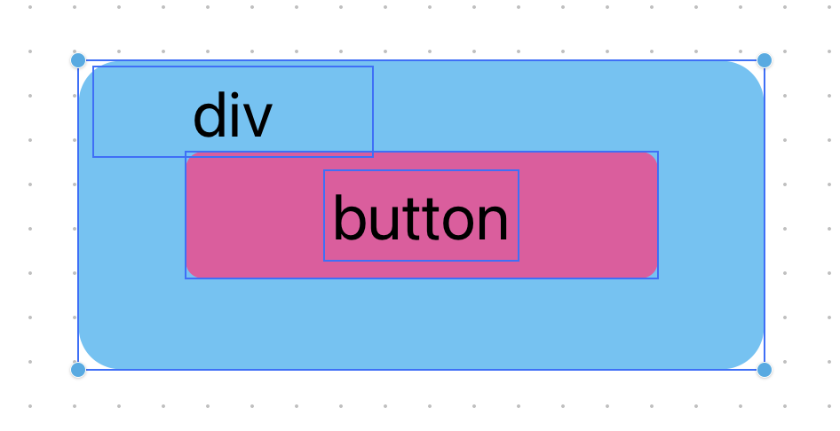

# Events in JavaScript (only frontend)

Every object registered in the DOM can trigger an event, and that event can be handled by JavaScript using a so called _event handler_ that is a piece of JavaScript code that we execute once the event is triggered.

Up to this moment, we saw only one way to define and event and an event handler, that is using the `addEventListener` method. However, there are two alternative ways to define and handle an event on a DOM's object, that are using the _event handler property_ or using an _inline event handler_.

## Event Handler Property

Inspecting a DOM's object through `console.dir`, we can see that there are many properties on this object starting with the _on_ prefix. There properties defines the event handler directly in the object and are triggered when an event occurs. In order to use this properties, we can simply assign them a function whose body is the code to be executed when the event occors:

```javascript
const div = document.getElementById('div');

div.onclick = function () {
      console.log('Will be called when the div is clicked ...');
};
```

Of course, the side effect of using this strategy, is that we cannot define multiple event handlers for the same event. While using the `addEventListener` we can register multiple instances of event handlers.

## Inline Event Handler

The alternative approach is to implement the event handler directly in the HTML code. However, this is considered a bad practice and must be avoided, first of all because is inefficient respect to the other approaces, and latter because is a good practice to keed separate the HTML code from the JavaScript code.

```html
<button type="button" onclick="console.log('click')"></button>
```

## Event Object

Let's consider this example:

```javascript
element.addEventListener('click', function (event) {
      console.log(event);
});
```

all event handler function receive a parameter which represents the event itself. There is a [long list of events](https://developer.mozilla.org/en-US/docs/Web/API/Event) that can be triggered, all of them instance of the Event interface.

However, there is a common property that all the instances of the Event interface share, that is the `target` property. In fact, all the time that we trigger an event, in this property is stored the Element that triggered the event itself. For instance, defining an event handler on the element Button, the `target` property is the button itself.

## Default Behaviours

There are some objects that have alredy an event handler associated, for example, take a look at this HTML code:

```html
<form action="">
      <button id="button" type="submit">Submit</button>
</form>
```

a Button whose type is specified as `submit` refresh the page once is clicked. In fact, this is the default behaviour of this object, and sometimes it can be useful to prevent this default behaviour. Fortunatly, there is a JavaScript method that can be called to prevent the normal event's execution, that is `preventDefault` defined on the `Event` object.

```javascript
document.getElementById('button').addEventListener('click', function (clickEvent) {
      clickEvent.preventDefault();
});
```

## Event Propagation

Let's consider this scenario, we have an HTML page defined as follows:

```html
<body>
      <div id="div">
            <button type="button" id="button">Button</button>
      </div>
</body>
```

on the other hand, we have a JavaScript code in which are defined the event handler for both the HTML elements:

```javascript
const div = document.getElementById('div');
const button = document.getElementById('button');

function eventHandler(event) {
      console.log(event.target.tagName);
}

div.addEventListener('click', eventHandler);

button.addEventListener('click', eventHandler);
```

By clicking on the button, two messages will be printed in the console: _Click fired on div_ and _Click fired on button_, why is this happening? The following figure explains well why is happening:



in fact, the `<button>` is actually inside the `<div>`, therefore, by clicking on the button we are actually click on the div, this behviour is correct and is called **bubbling**. Thus, how can we prevent is behaviour from happening again?

There is a JavaScript method called `stopPropagation` implementd in all `Event` objects, that actually stops the propagation of one event from a child element to all parents.

While event bubbling starts from the childres reaching the parent, the counterpart is known as **event capture** startin from the parent since the child element is reached. However, is behaviour is prevented by JavaScript by default, but can be activated by passing a parameter to the `addEventListener` method:

```javascript
function eventHandler(event) {
      console.log(event.target.tagName);
}
document.body.addEventListener('click', eventHandler, { capture: true });

div.addEventListener('click', eventHandler, { capture: true });

button.addEventListener('click', eventHandler);
```

## Event delegation

It seems that the _event bubbling_ is a JavaScript feature that must be avoided, howerver is come cases is quite useful. For instance, let's consider the following case, we have a container of 20 elements and once we clicked on one of them, the background color is changed. We can implement this functionality in JavaScript by assigning an event handler to each element of the container ... of course this is possible but we can do it better.

By using the _event bubbling_ behaviour, we can declare a envet handler just for the container, and then changing the background color only for the event target:

```javascript
container.addEventListener('click', function (event) {
      event.target.style.backgroundColor = '#FF00FF';
});
```
