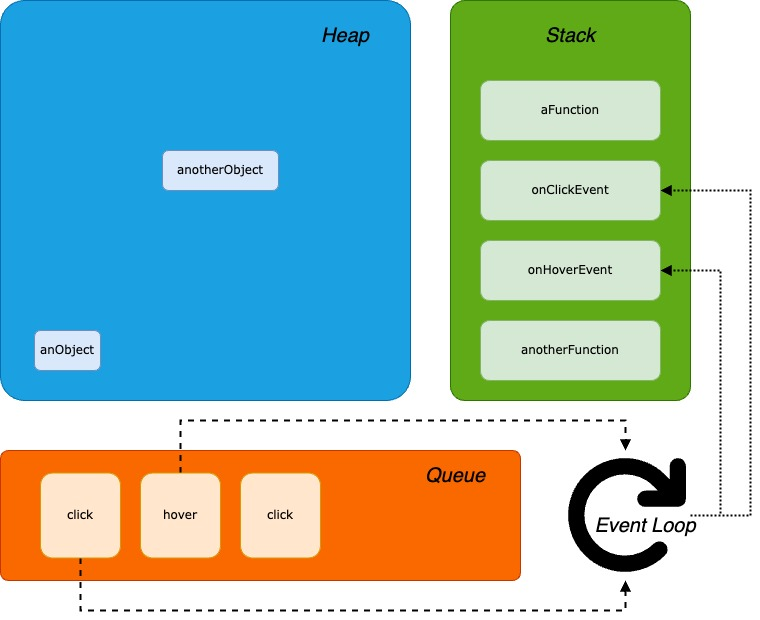

# Introduction to Async Programming

Back to the first chapters I already mentioned that JavaScript is a **single thread** programming language, it means that each script is executed as a single thread and the execution's flow starts from the top going to the bottom, executing each line of code one after the other and blocking the execution of the next istruction while the previous is not completed.

Of course this is practical since we can identify any error thrown by the application and stop the execution immediately. However, it is not practicable in real world application where for instance the user can wait untile the operation is completed. Let's consider this example, if any event handler would be synchronously executed it means that the the application would be blocked since the event is triggered, for example a button is pressed.

Now, JavaScript is a **single thread** programming language, so how can we create programs that can execute code asynchronously without blocking themselves? The solution proposed by JavaScript is to run asynchronous code outside JavaScript itself, and let the browser to assign and manage threads created by the program. However, if the code is execute outside JavaScript, how can be keep track of the execution, moreover, how can we ensure that something will be executed after a certain amount of time? Luckily, since function's are _first classe's citizens_ we place the code inside a function that will be triggered later. This particular kind of functions are called **callback functions**, and again we already saw an example of these functions with the event handler:

```javascript
function callback() {
      console.log('this is a callback function');
}

element.addEventListener('click', callback);
```

## Queue and Event Loop

There are three main components of the JavaScript Engine:

- The **Stack** where primitive values and functions are stored, and are kwnown as _frame_.

- On the other hand, the **Heap** is a large region of memory where objects are stored, for instance, every time we create a new object using the `new` keyword, the reference of this objects is added to the heap.

- Finally, the **Queue** contains a list of asynchronous messages to be executed, and associated with a function called to handle them.

Since the Queue contains the list of messages that are executed asynchronously, there should be something that whatches the messages' status, and notify to JavaScript that the execution is terminated, thus the function associated to the event can be triggered. This _listen-and-act_ mechanism is known as the **Event Loop**. From a techinical point of view, the Event Loop is no more than an infinite loop looking always for updates on the Queue. Let's take a look at this example:

```javascript
function aFunction() {
      console.log('aFunction');
}

function anotherFunction() {
      aFunction();
}

const anObject = new Object();
const anotherObject = new Object();

addEventListener('click', onClickEvent);
addEventListener('hover', onHoverEvent);

anotherFunction();
```

If we would like to represent this simple program in a diagram, something like this will be created:

<p align="center">
  
</p>

When the program is started, the two objects are added in the _Heap_ while the two callback functions are registered but they are not pushed into the stack, because the event associated to them is not triggered yet by a message. On the other the function `anotherFunction` is pushed into the stack and then the function `aFunction` too because is immediately called by the former. At some point while `aFunction` is executed but not completed yet, some messages are enqueued in the Queue, these are `click`, `hover` and `click` again, thus the _Event Loop_ recognize that a messages in enqueued and can push the associated callback function that is `onClickEvent` in the _Stack_,

## Promise

A **Promise** is an object created to manage asynchronous operations in JavaScript, and make cumbersome code that uses callback more readable. From a technical perspective, a Promise is a **Proxy** for a value resulting from an asynchronous operation, and about which we do not know the resulting value. We can associate to a Promise two callback function for success or failure of the asynchronous operation, using `then` and `catch` methods.

When we create and execute a Promise, it can assume three different internal values, based on current Promise's status:

- A Promise can assume the value **pending** if we created and execute the Promise, but the asynchronous operation associated to the Promise is not yet completed.

- If the asynchronous operation is completed successfully, then the Promise assumes the **fulfilled** status.

- On the other hand, if the asynchronous operation fails, the Promise assumes the **rejected** status.

To create a new Promise, is sufficient to instantiante a new `Promise` object, passing to the constructor the asynchronous operation to execute, with two parameters representing the callback functions to invoke for success or failure:

```javascript
const promise = new Promise((onResolve, onReject) => {
      setTimeout(() => {
            if (Math.random() > 0.5) {
                  return onResolve(true);
            }
            return onReject('error');
      }, 1000);
});
```

in this example we created a Promise that executes the asynchronous operation of wait 1s, and then we invoke the `onResolve` callback to indicate that the asynchronous operation success, and therefore the Promise assumes the status of **fulfilled**, or the callback `onReject` to indicate that operation has failed, and the Promise assumes the status of **rejected**.

### Chaining Promises

If we take a look at the methods `Promise.prototype.then`, `Promise.prototype.catch` and `Promise.prototype.finally` they all returns a `Promise` as result, this means that we can chain Promise calls to make code more readable, avoiding nesting Promise handling:

```javascript
function firstPromise() {
      return new Promise((onResolve, onReject) => {
            const randomValue = Math.random();
            if (randomValue > 0.2) {
                  return onResolve(randomValue);
            }
            return onReject(randomValue);
      });
}

function secondPromise(randomValue) {
      return new Promise((onResolve, onReject) => {
            if (randomValue > 0.5) {
                  return onResolve(randomValue);
            }
            return onReject(randomValue);
      });
}

function thirdPromise(randomValue) {
      return new Promise((onResolve, onReject) => {
            if (randomValue > 0.7) {
                  return onResolve(randomValue);
            }
            return onReject(randomValue);
      });
}

firstPromise()
      .then((result) => secondPromise(result))
      .then((result) => thirdPromise(result))
      .then((result) => console.log(result))
      .catch((result) => console.error(`error ${result}`));
```

in this easy example, we create three Promises, each one checks the value passed as parameter and resolves or rejects the Promise based on the passed value. Starting from the `firstPromise` we can chain the promises just returning the value from the callback function passed to the `then` function, that creates a new Promise with the value returned from the callback. If any of the Promise fails, then the `catch` method is triggered and the callback function is executed. In fact, in this code only values greater than 0.7 will be printed reaching the last `then` method.

N.B. In the previous example, I used `return` inside each async code of the Promise only to stop the execution without creating the `else` branch of the `if`, it is not necessary return a value because the async code inside the Promise returns `void`.

There is one last method used in Promises that is `finally`. Like in Java, where the `finally` clause in the `try-catch` block executed always after the try or the catch, this function behaves in the same way with Promise. Therefore, we can modify the previous example, and perform a cleaning operation after the Promise's execution:

```javascript
firstPromise()
      .then((result) => secondPromise(result))
      .then((result) => thirdPromise(result))
      .then((result) => console.log(result))
      .catch((result) => console.error(`error ${result}`))
      .finally(() => console.log('clean up ...'));
```

## Async / Await

There is an easier way to use Promises as if they were piece of synchonous code, and is using `async` and `await` keywords. By delcaring a function with the `async` prefix, we are indicating to JavaScript that that function is executed asynchronously, and then we can use the `await` keyword inside them, to threat asynchronously code like they would be synchronously. However, from an internal point of view, the code is still asynchronous, this is not a way to force asynchronous code execution.

Now, since a Promise can be fulfilled or rejected, we must also handling errors thrown by Promises that are called using the `await` keyword, by using the classic `try-catch` block. Considering the previous example, we can rewrite it in the following way:

```javascript
async function promiseHandler() {
      try {
            const firstValue = await firstPromise();
            const secondValue = await secondPromise(firstValue);
            const thirdValue = await thirdPromise(secondValue);
            return thirdValue;
      } catch (exception) {
            return exception;
      } finally {
            console.log('clean up ...');
      }
}

async function firstPromise() {
      const randomValue = Math.random();
      if (randomValue > 0.2) {
            return randomValue;
      }
      throw new Error(randomValue);
}

async function secondPromise(randomValue) {
      if (randomValue > 0.5) {
            return randomValue;
      }
      throw new Error(randomValue);
}

async function thirdPromise(randomValue) {
      if (randomValue > 0.7) {
            return randomValue;
      }
      throw new Error(randomValue);
}

promiseHandler().then((result) => {
      console.log(result);
});
```

First of all we changed all the function that returns a Promise in a new function declared as `async`, in other words they are still Promises but not can be invoked also by using the `await` keyword and not only by `then` or `catch`. Then, since the `await` keyword can be used only in functions delcared as asynchronously, we need to wrap the Promise handling inside a function and for this reason we created the `promiseHandler` function. Moreover, Promises are now called one after the other using `await` and error handling is not managed by the try-catch block.

However, since `await` can be used only in function declared with `async`, and these functions now returns a Promise, invoking the function `promiseHandler` returns a Promise that needs to be managed in the "classic" way, since we cannot use `await` in the script's body.

### Async / Away vs Promise

Summing up, `async / await` is a cleaner syntax respect to classic Promis hanlding, and there is no difference from performance perspective between these. However, sometimes using `async / await` can be lead to mistake thinking that the code is forced to be executed syncrhonously, but this is not true because you can use them only inside a function delcared as async, thus will not be syncrhonous code.

On the other hand, `async / await` forces the asynchronous code to be executed one after another respect to chaining Promise. In fact, let's condider this example:

```javascript
async function asyncPromiseHandler() {
      console.log(`[AsyncPromiseHandler] - start`);
      try {
            const firstValue = await firstPromise();
            const secondValue = await secondPromise(firstValue);
            const thirdValue = await thirdPromise(secondValue);
            console.log(`[AsyncPromiseHandler] - ${thirdValue}`);
      } catch (error) {
            console.error(`[AsyncPromiseHandler] - Error ${error}`);
      } finally {
            console.log(`[AsyncPromiseHandler] - clean up ...`);
      }
      console.log(`[AsyncPromiseHandler] - end`);
}

function promiseHandler() {
      console.log(`[PromiseHandler] - start`);
      firstPromise()
            .then((result) => secondPromise(result))
            .then((result) => thirdPromise(result))
            .then((result) => console.log(`[PromiseHandler] - ${result}`))
            .catch((error) => console.error(`[PromiseHandler] - Error ${error}`))
            .finally(() => console.log(`[PromiseHandler] - clean up ...`));
      console.log(`[PromiseHandler] - end`);
}
```

Running this code, you will notice that the logs for the function `asyncPromiseHandler` are always printed in the right order, while the `promiseHandler` logs will be printed in arbitrary order, since the code inside the function will be executed asynchronously and then there is no gurantee about the execution order.

## Promise.race(), Promise.all() & Promise.allSettled()

There are three more utility methods implemented inside the `Promise` class, that can be very useful when dealing with multiple asynchronous code blocks exection. If we would like to run multiple promises with different implementations, and get the result of the fastest one, you can use the `Promise.race()` method. This method takes an interable as input, that can be for example an array of promises, and returns the fastest promise that is fulfilled or rejected. For instance:

```javascript
function firstPromise() {
      return new Promise((onResolve, onReject) => {
            setTimeout(() => {
                  return onResolve('first');
            }, 2000);
      });
}

function secondPromise() {
      return new Promise((onResolve, onReject) => {
            setTimeout(() => {
                  return onResolve('second');
            }, 1000);
      });
}

Promise.race([firstPromise(), secondPromise()])
      .then((result) => console.log(result))
      .catch((err) => console.error(err));
```

the printed value will be always `second`, since the second promise is always the fastest between these. On the other hand, if the `secondPromise` to fail, the catch block will be triggered. If `Promise.race` returns the fastest Promise, we would like to execute all the promises togheter and get the resulting value from each execution. `Promise.all` in fact, executes everything, combining the result in just one array:

```javascript
function firstPromise() {
      return new Promise((onResolve, onReject) => {
            setTimeout(() => {
                  return onResolve('first');
            }, 2000);
      });
}

function secondPromise() {
      return new Promise((onResolve, onReject) => {
            setTimeout(() => {
                  return onResolve('second');
            }, 1000);
      });
}

Promise.all([firstPromise(), secondPromise()])
      .then((result) => console.log(result[0], result[1]))
      .catch((err) => console.error(err));
```

After that all the promises have been fulfilled, the resulting values inside the array will be printed. On the other hand, if at least of the promises fails, the catch block will be triggered and the error will be print. The counterpart of this method, is represented by `Promise.any` that returns at the first promise that fulfills, no mattter in which order.

Finally, as we can see `Promise.all` is rejected if at least one of the promise is rejected. If we would like to return all the promises, both rejected or fulfilled, we can use the `Promise.allSettled` method. However, differently from the last method, in this case the Promises' results will be put inside an object where is contained the result of the promise, and its final status:

```javascript
function firstPromise() {
      return new Promise((onResolve, onReject) => {
            setTimeout(() => {
                  return onResolve('first');
            }, 2000);
      });
}

function secondPromise() {
      return new Promise((onResolve, onReject) => {
            setTimeout(() => {
                  return onResolve('second');
            }, 1000);
      });
}

Promise.allSettled([firstPromise(), secondPromise()])
      .then((result) => console.log(result[0], result[1]))
      .catch((err) => console.error(err));
```

executing this code, something like this will be printed in the console `{ status: "fulfilled", value: "first" } { status: "fulfilled", value: "second" }`.
