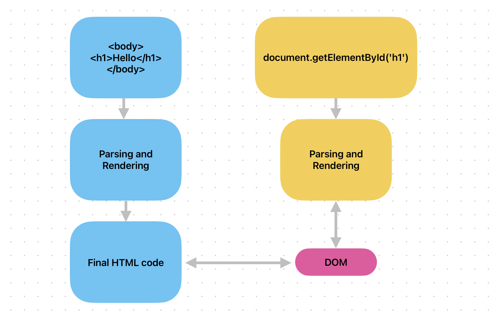
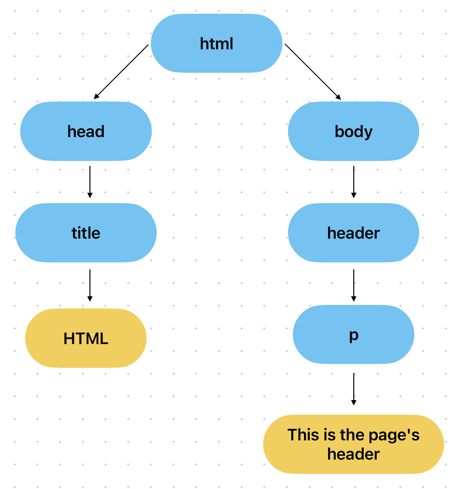

# HTML, JavaScript and DOM

Since JavaScript is mainly used for front-end applications, is important to understand how does it works with HTML and how HTML is actually managed by the browser. Therefore, in this section we will have a look on how these elements works and how they interacts with themselves.

## The DOM (Document Object Model)

Let's take a look on how the HTML and JavaScript code interact with each other:



when we create an HTML page with a JavaScript code connected to it, the browser and the interpreter parse and render both the code in order to use them. On the other hand, to make JavaScript able to use the HTML code, the Browser creates an object called **DOM** (_Document Object Model_), that is a sort of API that JavaScript can use to interact with the rendered HTML code.

The most important element contained in the DOM, is the abstract representation of our HTML page. Indeed, the HTML page is represented in the DOM as a tree, and therefore, we can navigate through the elements of the DOM from the top to the bottom like a tree.

However, the last paragraph is correct but incomplete, in fact, the DOM does not contain a simple representation of the HTML elements, but also the text contained in it. Considering the following HTML code:

```html
<html>
      <head>
            <title>HTML</title>
      </head>
      <body>
            <header>
                  <p>This is the page's header</p>
            </header>
      </body>
</html>
```

if we would like to represent this HTML as it is inside the DOM, the resoult would be something like this:


