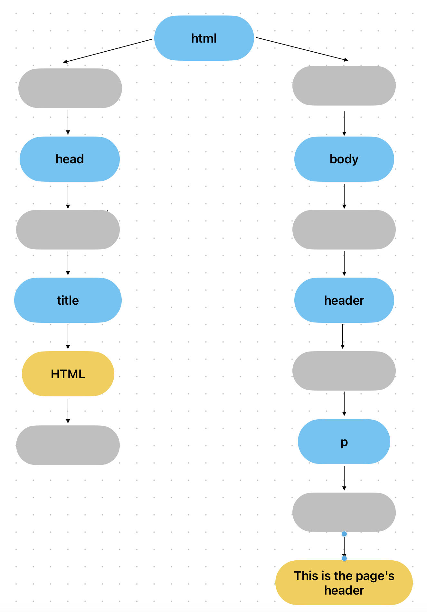

# HTML, JavaScript and DOM

Since JavaScript is mainly used for front-end applications, is important to understand how does it works with HTML and how HTML is actually managed by the browser. Therefore, in this section we will have a look on how these elements works and how they interacts with themselves.

## The DOM (Document Object Model)

Let's take a look on how the HTML and JavaScript code interact with each other:

<p align="center">
      
</p>

when we create an HTML page with a JavaScript code connected to it, the browser and the interpreter parse and render both the code in order to use them. On the other hand, to make JavaScript able to use the HTML code, the Browser creates an object called **DOM** (_Document Object Model_), that is a sort of API that JavaScript can use to interact with the rendered HTML code.

The most important element contained in the DOM, is the abstract representation of our HTML page. Indeed, the HTML page is represented in the DOM as a tree, and therefore, we can navigate through the elements of the DOM from the top to the bottom like a tree.

However, the last paragraph is correct but incomplete, in fact, the DOM does not contain a simple representation of the HTML elements, but also the text contained in it. Considering the following HTML code:

```html
<html>
      <head>
            <title>HTML</title>
      </head>
      <body>
            <header>
                  <p>This is the page's header</p>
            </header>
      </body>
</html>
```

if we would like to represent this HTML as it is inside the DOM, the resoult would be something like this:

<p align="center">
      
</p>

## Element vs Node

Unsuprisigly, the last chapter is not complete yet. Indeed, we have to examplain the difference between the rendered _elements_ of the HTML page and the _node_ that compose the DOM.

Let's take a look on the previous example:

```html
<html>
      <head>
            <title>HTML</title>
      </head>
      <body>
            <header>
                  <p>This is the page's header</p>
            </header>
      </body>
</html>
```

when the HTML code is translated in the DOM's tree, not only the HTML tags will be pushed as node in the structure, indeed, also white spaces are considered as nodes of the tree!

Therefore, a closure representation of the DOM's tree is the following:

<p align="center">
      
</p>

where the grey nodes of the tree are the white spaces. Understanding the difference between these two elements, is a key concept to understand the difference between these two methods used to traverse the DOM:

```javascript
const elements = document.children;
const nodes = document.childNodes;
```

However, if the white spaces are part of the DOM's tree, why these are not rendered to the browser. The answer is that, they are actually rendered by the browser, however, there is a CSS that hides them, that is _white-space: pre_

## Creating new element in the DOM

If we would like to create a new element to be inserted in the DOM's tree, there are two ways of doing this. Morevoer, there are two functions to use:

- **innerHTML** that injects new HTML inside the existing code.

- while, **createElement** that creates a new HTML element.

What is the difference between them and why should we use one instead of another? Well, the difference is quite intuitive and evidente, while _innerHTML_ adds new HTML to the existing one, forces the browser to render the whole code again, therefore, if we are working on a huge project, it would be bad from performances point of view. An example of how to use the _innerHTML_ function is:

```javascript
const list = document.querySelector('ul');
const newElement = `<li>New element</li>`;

list.innerHTML = list.innerHTML + newElement;
```

On the other hand, creating a new element using the _createElement_ method, will not force the code to be parsed again, indeed, only the updated part will be parsed:

```javascript
const list = document.querySelector('ul');

const newElement = document.createElement('li');
newElement.textContent = 'New element';

list.appendChild(newElement);
```

of course, the side node of this approach is that it required more code to be written.
