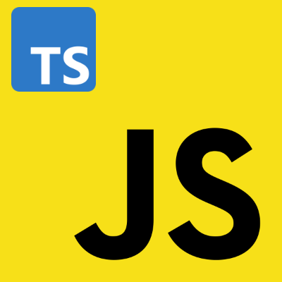

# Typescript

<p align="center">

</p>

Now that we have a deeper understand of JavaScript, we have to have a look on TypeScript. In fact, TypeScript is a **superset** of JavaScript, that is it is not a completely independent programming language, however, is a <u>programming languaged build upon another, in this case JavaScript</u>. Moreover, since TypeScript is not a programming language, it cannot be executed by the browser, but it must be **transpilled** in JavaScript's code, meaning that the <u>TypeScript code will be converted in its JavaScript's counterpart</u>, preserving the business login but using only JavaScript's feature.

Up to this point, we have a programming language, that is not a programming language, and that cannot be executed by any JavaScript's engine like V8, so why should we use TypeScript insead of normal JavaScript? Well, to answer this question, we have to use an example, let's consider the following code:

```javascript
function printPersonName(firstName, lastName) {
      return firstName + lastName;
}

console.log(printPersonName(1, 'Rossi'));
```

Despite JavaScript will execute this code correctly, does it means that the output will be the same that we expect? Well, I mean that we are supposing that the function `printPersonName` takes as parameter two strings represented by `firstName` and `lastName` and concatenate them in an new one. However, we are going to pass as first parameter a number and we would like to avoid that. I won't be a problem if JavaScript could allows us to use type checking, but it can ... that is the reason about why we are going to use TypeScript.

Of course we will not study TypeScript just because it is a JavaScript's version with types, in fact, TypeScript adds many programming features that JavaScript does not have, for instance:

- Object-oriented structures like **Generics** and **Interfaces** are not supported by JavaScript, but they are in TypeScript.

- We saw **Meta-Programming Features** in JavaScript like **Proxy** or **Symbols**, while TypeScript adds also **Decorators**.

- Moreover, TypeScript offers an enriched configuration, and can tranpile our code in a JavaScript version supported also by older browsers, without intalling additional tools like **Babel**.

## Installation and Setup

If you are going to use TypeScript for the first time, you have to install [`Node.js`](https://nodejs.org/en) since you will need `Npm` to install easily TypeScript. Once you have installed `Node.js`, you can run the command:

```shell
npm install -g typescript
```

to install the latest version of TypeScript globally on your machine. Once TypeScript has been installed successfully, we can use the comand:

```shell
tsc file.ts
```

to transpile the file `file.ts` in its JavaScript counterpart. Beaside TypeScript, we will use another development tools `lite-server` that allows us to serve JavaScript files attached to an HTML file, listening for updates and applying them to our code.

Up to this point, it is quite difficult to use TypeScript since we have to compile each file individually and manually using the previous command. However, TypeScript can be configurated using a `tsconfig.json` file, where in we can specify additional commands and behaviours of the TypeScript compiler, that makes easier our work. Moreover, if you do not want to create that file manyally, you can use the commando `tsc --init`, that generates the file automatically.

### TypeScript configuraton file (tsconfig.json)

Now that we have configurated our `tsconfig.json` file, have to have a look about the configuration keys, defining the TypeScript's compiler behaviour:

- while we are compiling a TypeScript file in its JavaScript counterpart, we have to decide which version of ECMAScript we would like to use. Up to this point, the `target` property indicates the ECAScript version used to generate the JavaScript file, in fact, if we would like to generate JavaScript files that have to runnable in older browser using the `es3` value is a good choice, in fact, it is the default values used to TypeScript if we do not specify anything.

- after compile a TypeScript file, we can indicate which library will be used by our files. Therefore, `lib` takes a collection of dependences that will be injected in our final file.

- if we would like to debug our file from the browser, we have to use only JavaScript files, however, if the output file will grow and begin unreadable, the debugging process will be quite impossibile. Thus, we need `.map` files that map our JavaScript file in the original TypeScript, and this kind of files are generated using the `sourceMap` property.

- `rootDir` and `outDiv` are used to indicate the root directory and the directory where the output file will be places.

- even if there are errors in out TypeScript files, they will be still compiled in JavaScript, if we would like to avoid this behaviour, we have to set the `noEmitOnError` property.

- `exclude` takes a the input file names that must be ignored during the compilation process, while `include` is used to indicate files that must be included in the compilation process, of course if no file is specified, it means that allw the files starting from the root directory will be included.
